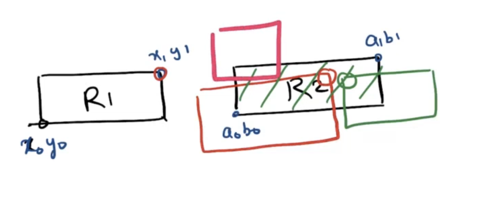
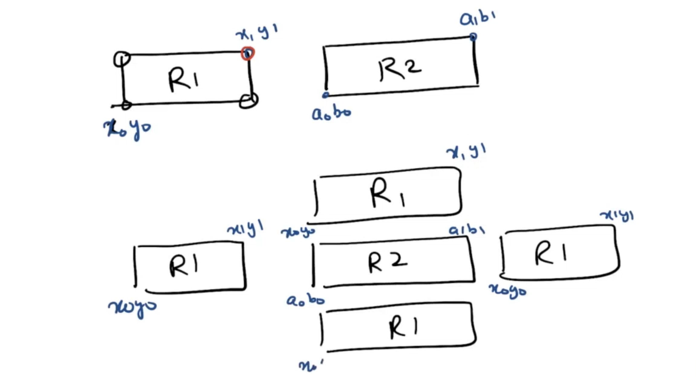

# Overlapping Reactangles
An axis-aligned rectangle is represented as a list [x1, y1, x2, y2], where (x1, y1) is the coordinate of its bottom-left corner, and (x2, y2) is the coordinate of its top-right corner. Its top and bottom edges are parallel to the X-axis, and its left and right edges are parallel to the Y-axis.

Two rectangles overlap if the area of their intersection is positive. To be clear, two rectangles that only touch at the corner or edges do not overlap.

Given two axis-aligned rectangles rec1 and rec2, return true if they overlap, otherwise return false.


```
Input: rec1 = [0,0,2,2], rec2 = [1,1,3,3]
Output: true
```

# Optimal Solution - Out of the Box
 

For the above image we have to write make conditions to check wheather they are overlapping or not.

instead write codition for not overlapping - out of the box.
 

 ```
class Solution {
public:
    bool isRectangleOverlap(vector<int>& rec1, vector<int>& rec2) {

        int x0 = rec1[0], y0 = rec1[1], x1 = rec1[2], y1 = rec1[3];
	    int a0 = rec2[0], b0 = rec2[1], a1 = rec2[2], b1 = rec2[3];

        return !(x1 <= a0 || y0 >= b1 || x0 >= a1 || b0 >= y1);
    }
};
 ```

